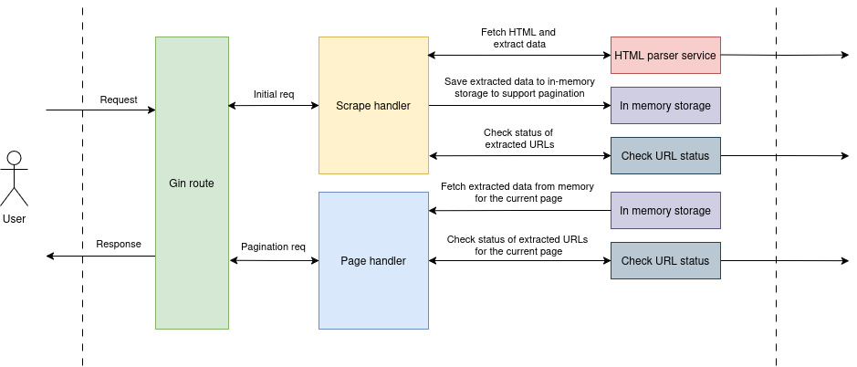

# Scraper API

An API service to scrape a URL and get a summary.

## High level architecture



### Components

1. Scrape handler - Handles the initial scrape request.
2. Page handler - Handles subsequent pagination requests.
3. HTML parser - Fetch the HTML content of the given URL and process.
4. In-memory storage - Holds fetched information mapped to a random unique key.
5. URL status checker - Checks statuses of URLs found on HTML content.

### Design concerns

> Checking statuses of URLs found on the scrapped HTML content was identified as the most expensive operation as of now in this application. Though we use `go routines`, the response latency of URLs makes a huge impact on system performance and response time of this API. To tackle this issue, we decided not to process all found URLs at the first request. We trigger only 10 URLs to check the status, and keep the rest in memory with the support of pagination. So user can request as batches of 10 URLs per request on subsequent pagination requests. With this approach we were able scrape websites with huge amount of URLs (ie: yahoo.com) effortlessly and without breaking the system. 

#### Further improvements

* We can replace the in-memory storage with a database.
* We can use a messaging technique to pass data changes in real-time to the UI.

## Configurations

You can change following configurations on the `.env` file.

```bash
# Application port
APP_PORT=8080

# Page size for the URL status check
URL_STATUS_CHECK_PAGE_SIZE=10

# Outgoing scrape request timeout
OUT_GOING_SCRAPE_REQ_TIMEOUT=30 # in seconds

# Outgoing URL accessibility check timeout
OUT_GOING_URL_ACCESSIBILITY_CHECK_TIMEOUT=10 # in seconds
```

## How to run using Docker

* Run `docker-compose up --build`

## How to run tests

* Run `go test -coverprofile=coverage.out ./...`
* To check the test coverage run `go tool cover -func=coverage.out`
* Test coverage output:

```bash
scraper/cmd/main.go:12:			    main			        0.0%
scraper/handlers/scrape.go:19:		ScrapeHandler		    94.1%
scraper/handlers/scrape.go:51:		PageHandler		        85.7%
scraper/logger/logger.go:14:		Debug			        100.0%
scraper/logger/logger.go:18:		Info			        0.0%
scraper/logger/logger.go:22:		Error			        100.0%
scraper/services/htmlparser.go:13:	FetchPageInfo		    100.0%
scraper/services/htmlparser.go:24:	ParseHTML		        90.9%
scraper/services/htmlparser.go:64:	traverse		        80.0%
scraper/services/htmlparser.go:74:	extractHref		        75.0%
scraper/services/htmlparser.go:83:	resolveURL		        100.0%
scraper/services/htmlparser.go:89:	isInternal		        100.0%
scraper/services/htmlparser.go:96:	containsPasswordInput	100.0%
scraper/services/htmlparser.go:112:	extractTitle		    100.0%
scraper/services/htmlparser.go:125:	extractHtmlVersion	    50.0%
scraper/services/urlstatus.go:21:	CheckURLStatus		    100.0%
scraper/storage/memory.go:15:		StorePageInfo		    100.0%
scraper/storage/memory.go:24:		RetrievePageInfo	    100.0%
scraper/storage/memory.go:32:		generateID		        100.0%
scraper/storage/memory.go:36:		randomString		    100.0%
scraper/utils/helpers.go:10:		CalculateTotalPages	    100.0%
scraper/utils/helpers.go:14:		CalculatePageBounds	    100.0%
scraper/utils/helpers.go:20:		min			            66.7%
scraper/utils/helpers.go:27:		BuildPageResponse	    50.0%
total:					            (statements)		    86.6%

```

## API Documentation

#### Request
1. Srape a URL

> * Request type: `GET`
> * URL: `http://localhost:8080/scrape?url=<URL to scrape>`
> * Parameters:
>    * `URL` - URL to scrape

#### Response

1. Success response

```json
{
    "request_id": "20250102001144-oTtblaYW",
    "pagination": {
        "page_size": 10,
        "current_page": 1,
        "total_pages": 5,
        "next_page": "/scrape/20250102001144-oTtblaYW/2"
    },
    "scraped": {
        "html_version": "HTML 5",
        "title": "Facebook – log in or sign up",
        "headings": {
            "h2": 1
        },
        "contains_login_form": true,
        "total_urls": 48,
        "internal_urls": 24,
        "external_urls": 24,
        "paginated": {
            "inaccessible_urls": 0,
            "urls": [
                {
                    "url": "https://facebook.com",
                    "http_status": 200,
                    "error": null
                },
                {
                    "url": "https://www.facebook.com/recover/initiate/?privacy_mutation_token=eyJ0eXBlIjowLCJjcmVhdGlvbl90aW1lIjoxNzM1NzU2OTA0LCJjYWxsc2l0ZV9pZCI6MzgxMjI5MDc5NTc1OTQ2fQ%3D%3D&ars=facebook_login&next",
                    "http_status": 200,
                    "error": null
                },
                {
                    "url": "https://facebook.com/r.php?entry_point=login",
                    "http_status": 200,
                    "error": null
                },
                {
                    "url": "https://facebook.com/pages/create/?ref_type=registration_form",
                    "http_status": 200,
                    "error": null
                },
                {
                    "url": "https://www.facebook.com/",
                    "http_status": 200,
                    "error": null
                },
                {
                    "url": "https://si-lk.facebook.com/",
                    "http_status": 200,
                    "error": null
                },
                {
                    "url": "https://ta-in.facebook.com/",
                    "http_status": 200,
                    "error": null
                },
                {
                    "url": "https://es-la.facebook.com/",
                    "http_status": 200,
                    "error": null
                },
                {
                    "url": "https://de-de.facebook.com/",
                    "http_status": 200,
                    "error": null
                },
                {
                    "url": "https://it-it.facebook.com/",
                    "http_status": 200,
                    "error": null
                }
            ]
        }
    }
}
```

2. Error response

```json
{
    "error": "Error message"
}
```
